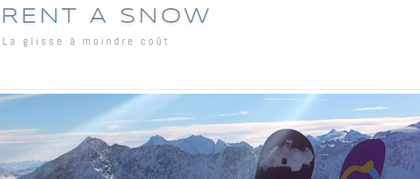

# ICT - 133

Pour la suite du module, vous allez développer une application en PHP sans base de données pour un site de location de snows (RentASnow). Pour ce faire, vous allez utiliser un ***template*** déjà existant.

Vous trouverez les fichiers nécessaires. Pour commencer, clonez ce dépôt. Il est important de garder la structure proposée car elle répond à des normes qui permettent de programmer votre site de façon plus professionnelle.

Le template en question utilise Boostrap ce qui implique que vous pouvez utiliser les classes existantes sans souci. 
Le site que vous allez créer aura les **fonctionnalités** suivantes :

- calendrier du mois avec choix de jour
- login avec contrôle sur un fichier de cookie
- logs afin de voir qui s'est connecté sur le site
- affichage de produits listés dans un CSV
- CRUD produits si le temps le permet
